# Creator It
Creator It is a SEO optimisation and recommendation website for Youtubers, Instagram creators and other platforms creator.

## Logo
<!--  -->

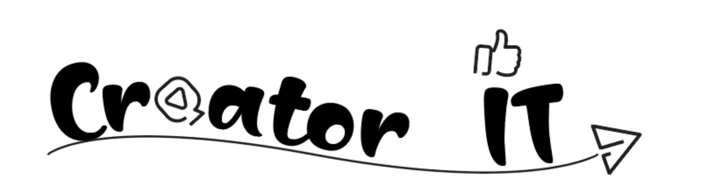

# Website Interface
### 1. Login Page
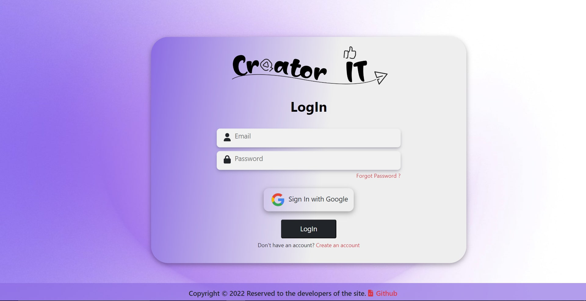
### 2. SignUp Page
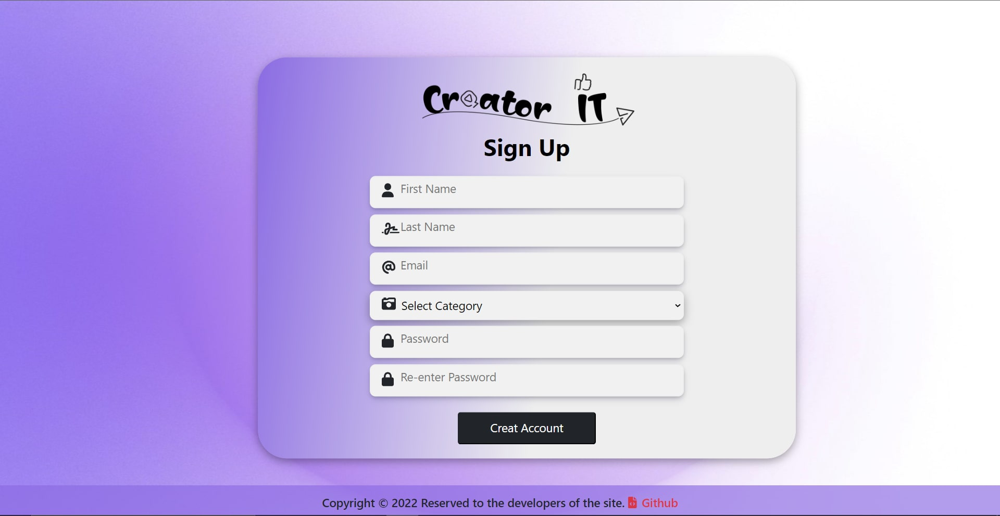
### 3. Services and Prediction by website

### 4. Select Category Page
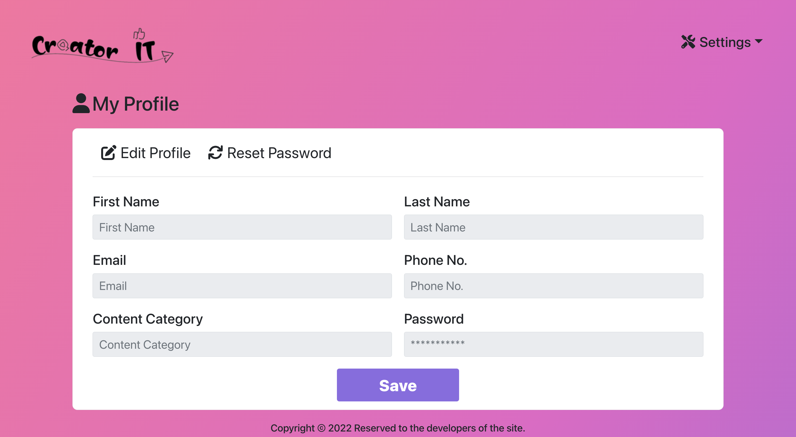
### 5. Select Prediction Page
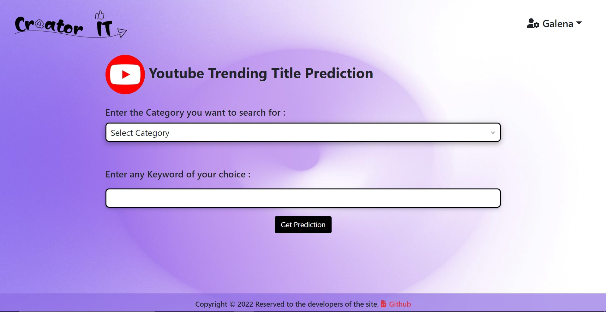
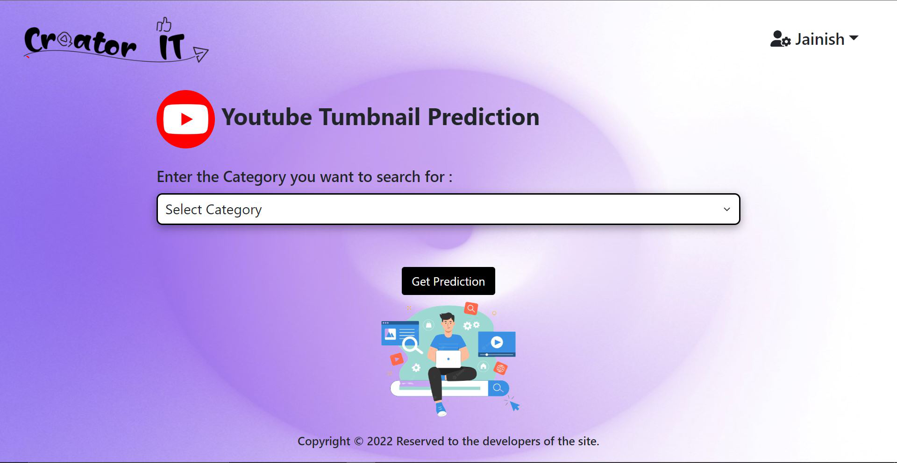
### 6. Profile Page
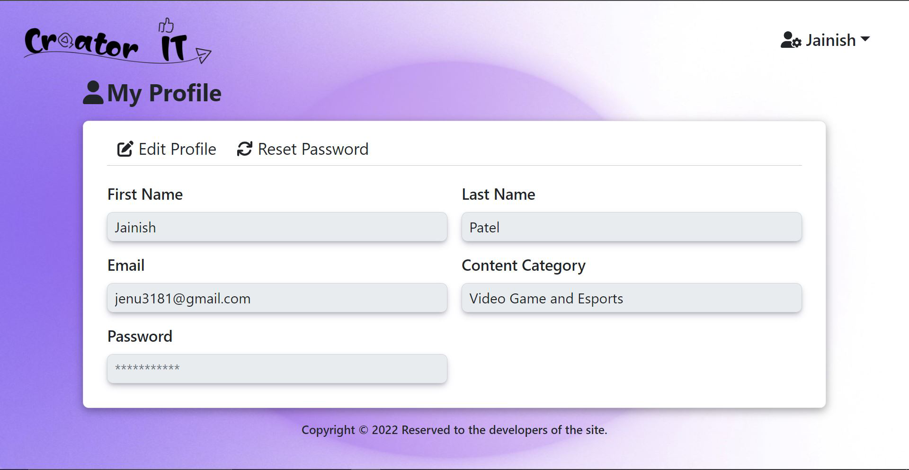
### 7. Edit Profile Page
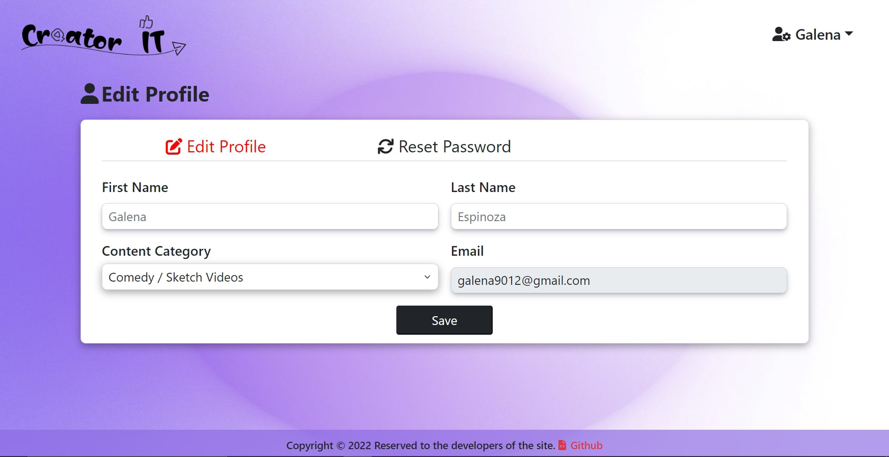
### 8. Reset password Page
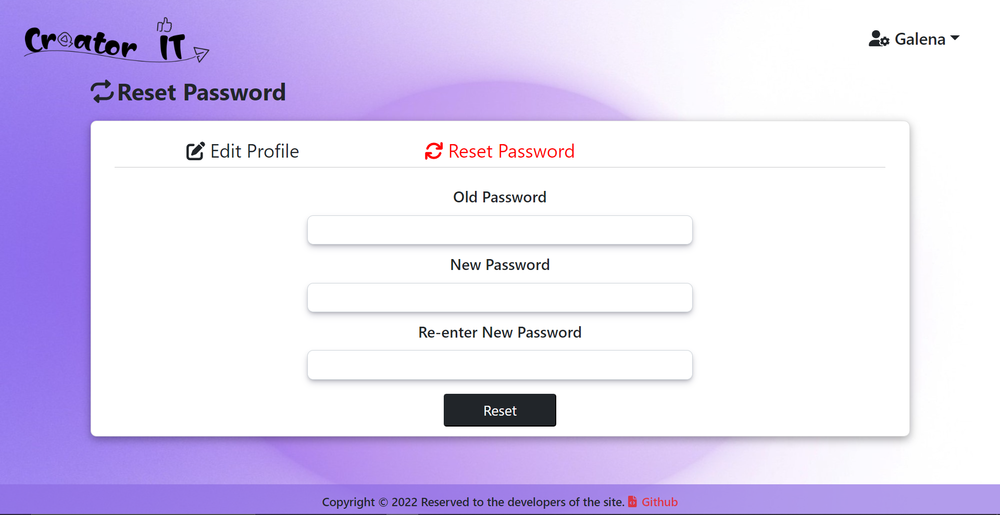
### 9. Email verification Page
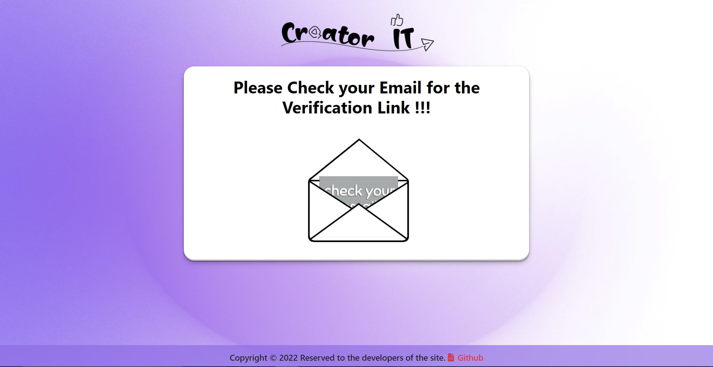
### 10. Verification complete Page
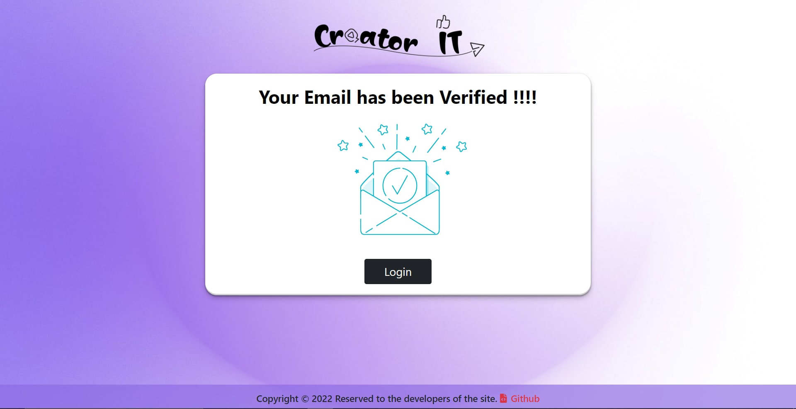
### 10. Predition
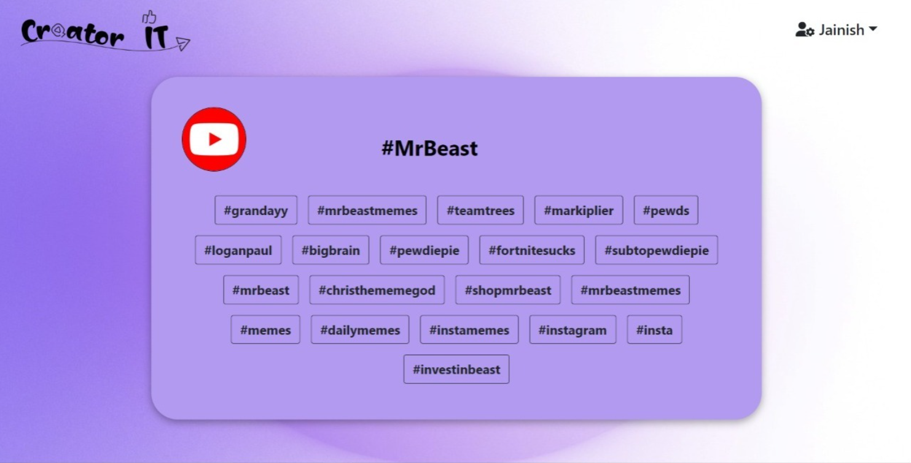
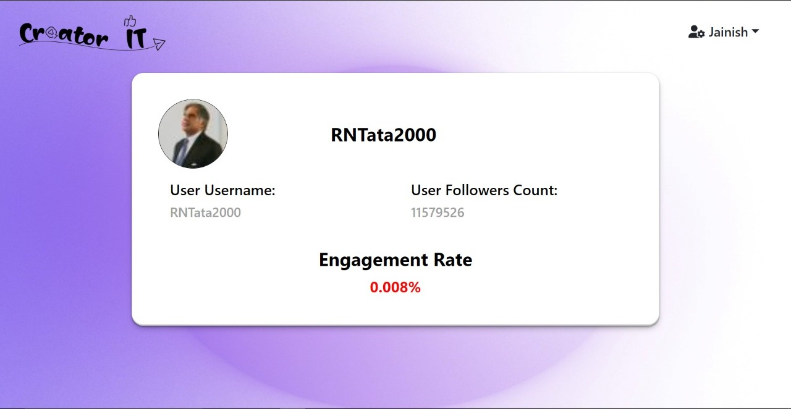
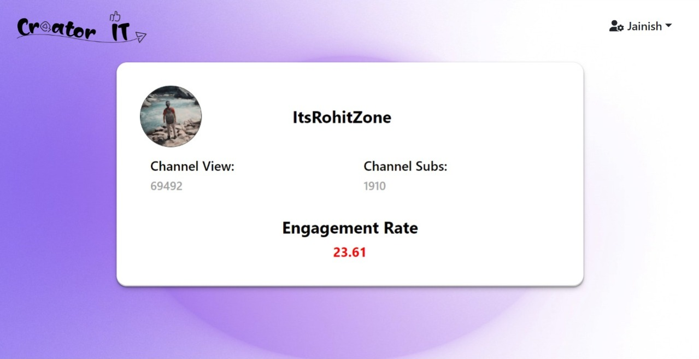

## Software Development Life Cycle
[webpage link](https://github.com/polonium31/creator_it/tree/main/SDLC)

## Tech Stack
1. Front-end: React v18, Bootstrap v5 
2. Back-end: Django v4
